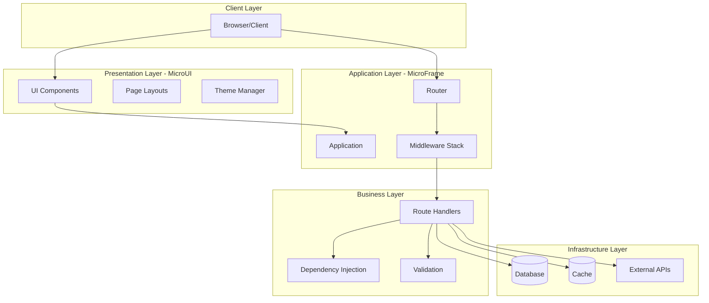
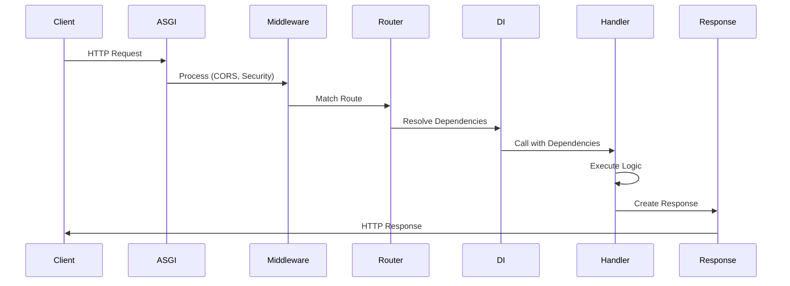
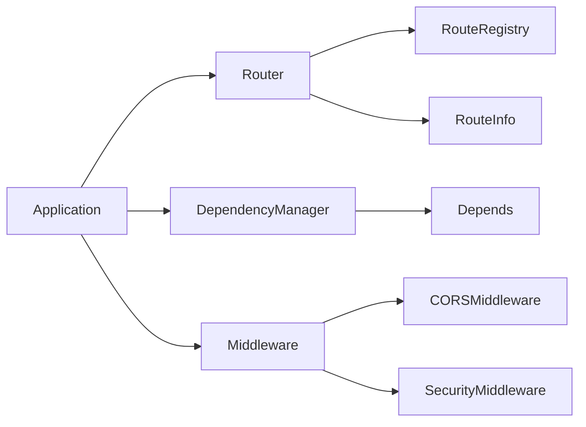
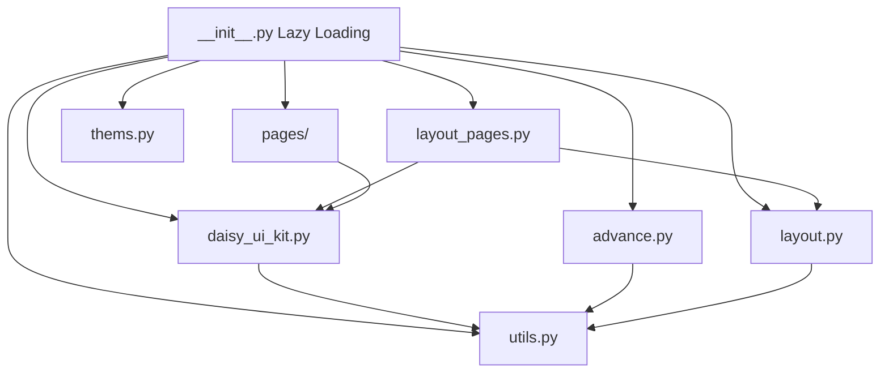
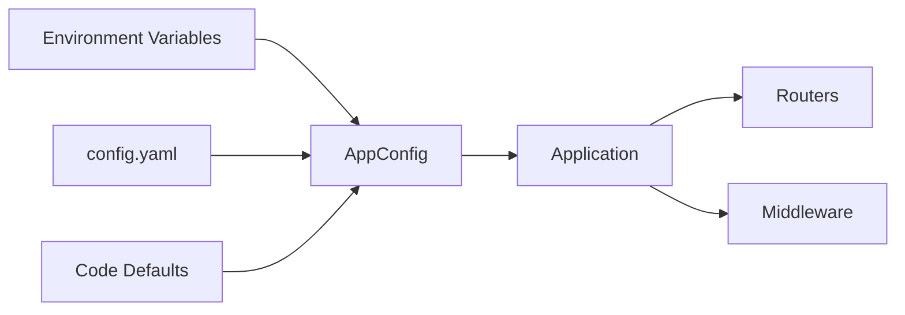

# MicroFrame - Architecture Globale

Documentation complète de l'architecture du framework MicroFrame v2.0.

## Vue d'ensemble

MicroFrame est un framework ASGI moderne composé de deux parties principales:
- **MicroFrame Core** - Framework backend (routing, DI, middleware, validation)
- **MicroUI** - Bibliothèque de composants UI (DaisyUI pour Python/HTMX)

## Structure du Projet

```
microframe/
├── microframe/              # Framework core
│   ├── core/               # Application principale et configuration
│   │   ├── application.py  # Classe Application (ASGI)
│   │   ├── config.py       # AppConfig
│   │   └── exceptions.py   # Exceptions personnalisées
│   │
│   ├── routing/            # Système de routage
│   │   ├── router.py       # Classe Router
│   │   ├── models.py       # RouteInfo
│   │   ├── registry.py     # RouteRegistry
│   │   └── decorators.py   # Décorateurs de routes
│   │
│   ├── dependencies/       # Injection de dépendances
│   │   ├── manager.py      # DependencyManager
│   │   └── models.py       # Depends
│   │
│   ├── middleware/         # Middlewares
│   │   ├── cors.py         # CORS
│   │   ├── security.py     # Security headers
│   │   └── security_middleware.py
│   │
│   ├── validation/         # Validation Pydantic
│   │   └── parser.py       # Request parser
│   │
│   ├── docs/              # Documentation OpenAPI
│   │   ├── openapi.py     # Générateur de schéma
│   │   └── ui.py          # Swagger/ReDoc UI
│   │
│   ├── templating/        # Moteur de templates
│   │   └── engine.py      # Jinja2 engine
│   │
│   └── utils/             # Utilitaires
│       └── logger.py      # Logging
│
├── microui/                # Bibliothèque UI
│   ├── daisy_ui_kit.py    # Composants de base (50 lignes)
│   ├── advance.py         # Composants avancés
│   ├── layout.py          # Layouts (Pricing, Contact)
│   ├── layout_pages.py    # Pages complètes
│   ├── pages/             # Pages auth et user
│   │   ├── authpage.py
│   │   ├── profilePage.py
│   │   ├── userManager.py
│   │   └── settings.py
│   ├── utils.py           # Helpers HTML
│   └── thems.py           # Gestion des thèmes
│
├── docs/                   # Documentation
│   ├── microframe/        # Docs du framework
│   └── microui/           # Docs des composants UI
│
└── examples/              # Exemples d'utilisation
```

## Architecture en Couches



## Flux de Requête

### 1. Requête Entrante

```
Client HTTP Request
    ↓
ASGI Server (Uvicorn)
    ↓
Starlette (Base)
    ↓
MicroFrame Application
```

### 2. Traitement de la Requête



### 3. Détail du Pipeline

1. **ASGI Layer** - Receive HTTP request
2. **Middleware Stack**:
   - CORS headers
   - Security headers
   - Rate limiting
   - Custom middleware
3. **Router**:
   - Match URL pattern
   - Extract path parameters
   - Load route metadata
4. **Dependency Injection**:
   - Resolve dependencies
   - Cache dependencies if configured
   - Inject into handler
5. **Validation**:
   - Parse request body
   - Validate with Pydantic
   - Type conversion
6. **Handler Execution**:
   - Execute business logic
   - Access database/services
   - Generate response
7. **Response**:
   - Serialize response
   - Add headers
   - Return to client

## Interaction des Modules

### MicroFrame Core



### MicroUI



## Patterns d'Architecture

### 1. Dependency Injection

```python
# Simple injection
def get_db():
    return Database()

@app.get("/users")
async def list_users(db=Depends(get_db)):
    return db.query_all()

# Nested dependencies
def get_repo(db=Depends(get_db)):
    return UserRepository(db)

@app.get("/users/{id}")
async def get_user(id: int, repo=Depends(get_repo)):
    return repo.get(id)
```

### 2. Modular Routing

```python
# Organize by feature
users_router = Router(prefix="/users", tags=["Users"])
posts_router = Router(prefix="/posts", tags=["Posts"])

# Nest routers
api_router = Router(prefix="/api/v1")
api_router.include_router(users_router)
api_router.include_router(posts_router)

# Include in app
app.include_router(api_router)
```

### 3. Middleware Stack

```python
# Execution order: bottom to top
app.add_middleware(SecurityMiddleware)  # Executes last
app.add_middleware(CORSMiddleware)      # Executes first
```

### 4. Lazy Loading (MicroUI)

```python
# components load on-demand
from microui import Button  # Only loads daisy_ui_kit.py

# Reduces startup by ~60%
```

## Architecture de Données

### Configuration Flow



### State Management

```python
# Application state
app.state.db = Database()
app.state.cache = Cache()

# Request state
request.state.user = current_user
request.state.theme = "dark"
```

## Composants Clés

### 1. Application (Core)

Responsabilités:
- Initialiser Starlette ASGI app
- Enregistrer les routes
- Gérer les middlewares
- Configurer la documentation
- Gérer les exceptions

### 2. Router (Routing)

Responsabilités:
- Organiser les routes en modules
- Supporter les préfixes et tags
- Gérer les dépendances au niveau router
- Permettre l'imbrication

### 3. DependencyManager (Dependencies)

Responsabilités:
- Résoudre les dépendances
- Supporter le caching
- Détecter les dépendances circulaires
- Gérer async/sync

### 4. Validation (Validation)

Responsabilités:
- Parser le body de la requête
- Valider avec Pydantic
- Convertir les types
- Retourner des erreurs 422

### 5. MicroUI (UI)

Responsabilités:
- Rendre les composants HTML
- Gérer les thèmes DaisyUI
- Intégrer HTMX
- Fournir des layouts complets

## Optimisations

### Performance

1. **Lazy Loading** - Composants chargés à la demande (~60% plus rapide)
2. **Dependency Caching** - Réutilisation des dépendances
3. **Route Registry** - Recherche O(1)
4. **Utility Helpers** - ~80 lignes de code en moins

### Code Quality

1. **Type Hints** - Typage complet partout
2. **Pydantic Models** - Validation automatique
3. **Separation of Concerns** - Modules indépendants
4. **DRY Principle** - Utilitaires réutilisables

## Patterns de Développement

### Application Structure

```python
project/
├── app/
│   ├── __init__.py
│   ├── main.py          # Application entry point
│   ├── config.py        # Configuration
│   ├── models.py        # Pydantic models
│   ├── dependencies.py  # Shared dependencies
│   │
│   ├── routers/         # Feature routers
│   │   ├── users.py
│   │   ├── posts.py
│   │   └── auth.py
│   │
│   ├── services/        # Business logic
│   │   ├── user_service.py
│   │   └── auth_service.py
│   │
│   └── repositories/    # Data access
│       └── user_repo.py
│
├── templates/           # Jinja2 templates
├── static/             # CSS, JS, images
└── tests/              # Tests
```

### Recommended Structure

```python
# main.py
from microframe import Application
from app.routers import users, posts
from app.config import settings

app = Application(configuration=settings)

app.include_router(users.router)
app.include_router(posts.router)

# routers/users.py
from microframe import Router
router = Router(prefix="/users", tags=["Users"])

@router.get("/")
async def list_users():
    return []

# services/user_service.py
class UserService:
    def __init__(self, repo):
        self.repo = repo
    
    async def get_all(self):
        return await self.repo.find_all()
```

## Sécurité

### Built-in Security

1. **CORS** - Protection cross-origin
2. **Security Headers** - XSS, clickjacking protection
3. **Rate Limiting** - Protection contre les abus
4. **Input Validation** - Validation Pydantic
5. **HTTPS** - Support natif
6. **CSRF** - Token support

### Best Practices

```python
# 1. Use environment variables
config = AppConfig(
    secret_key=os.getenv("SECRET_KEY"),
    debug=os.getenv("DEBUG") == "true"
)

# 2. Restrict CORS
app.add_middleware(
    CORSMiddleware,
    allow_origins=["https://yourdomain.com"]
)

# 3. Enable rate limiting
app.add_middleware(
    SecurityMiddleware,
    rate_limit_requests=100,
    rate_limit_window=60
)
```

## Tests

### Test Structure

```python
# tests/test_users.py
from httpx import AsyncClient
from app.main import app

async def test_list_users():
    async with AsyncClient(app=app, base_url="http://test") as client:
        response = await client.get("/users")
        assert response.status_code == 200
```

## Déploiement

### Production Setup

```bash
# Install
pip install microframe uvicorn[standard]

# Run
uvicorn app.main:app --host 0.0.0.0 --port 8000 --workers 4
```

### Docker

```dockerfile
FROM python:3.9-slim
WORKDIR /app
COPY requirements.txt .
RUN pip install -r requirements.txt
COPY . .
CMD ["uvicorn", "app.main:app", "--host", "0.0.0.0", "--port", "8000"]
```

### Configuration Production

```python
config = AppConfig(
    title="Production API",
    debug=False,
    openapi_url=None,  # Disable in production
    docs_url=None,
    cors_origins=["https://yourdomain.com"],
    rate_limit_enabled=True
)
```

## Extensions Futures

Voir [ROADMAP.md](../ROADMAP.md) pour la roadmap complète.

---

## Ressources

- **[Documentation MicroFrame](microframe/README.md)**
- **[Documentation MicroUI](microui/README.md)**
- **[Guide de Migration](../MIGRATION_GUIDE.md)**
- **[Exemples](../examples/)**

---

**Version:** 2.0.0  
**License:** MIT  
**Auteur:** traoreera
