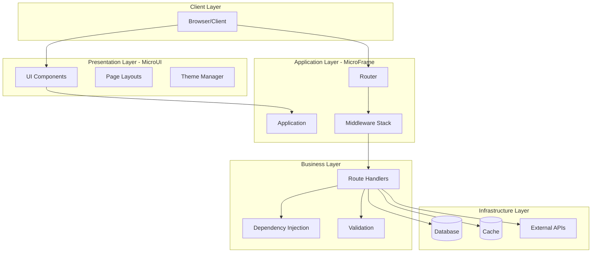
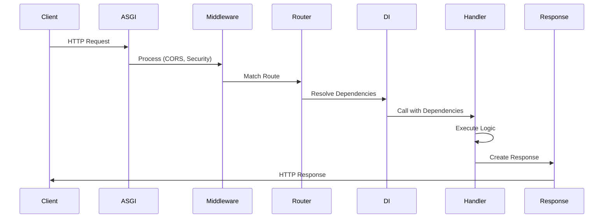
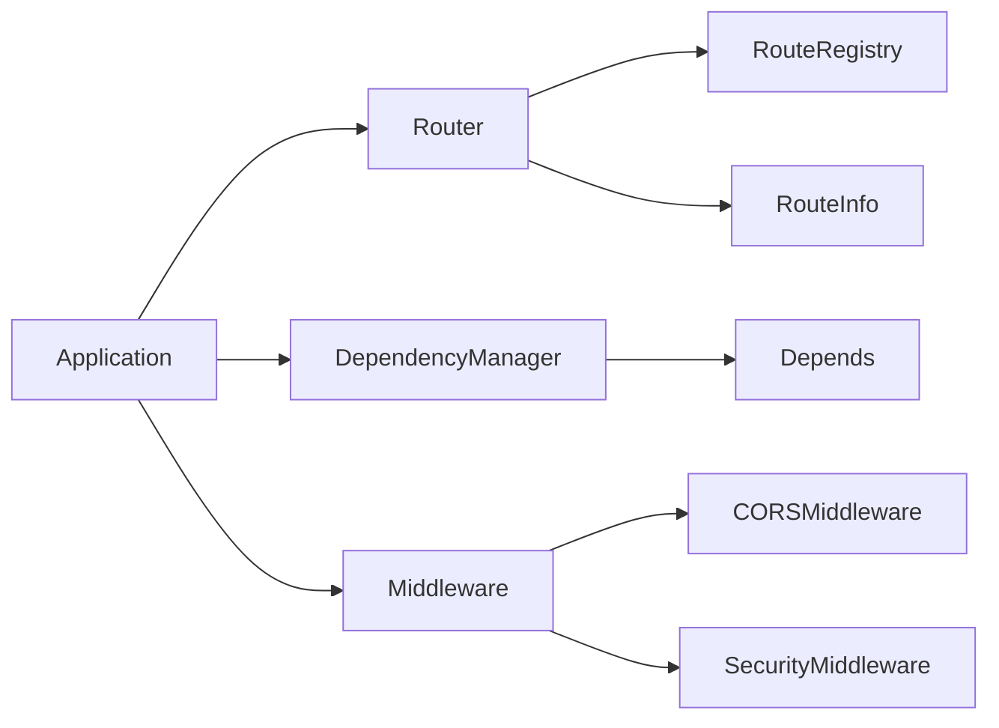
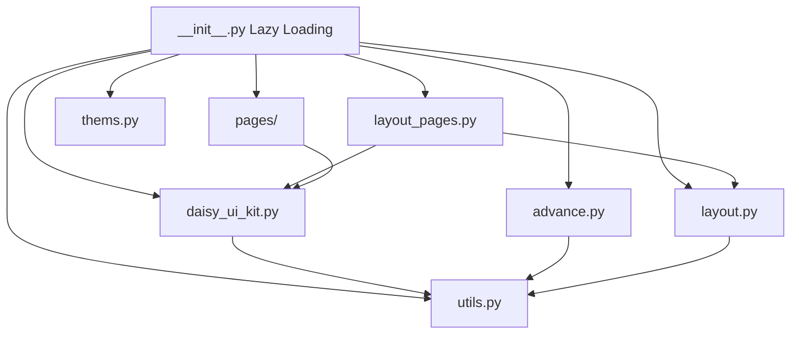

# Architecture Modulaire - MicroFramework v2.0

## Vue d'ensemble

Le framework a été entièrement refactorisé avec une architecture modulaire claire qui sépare les responsabilités et facilite la maintenance et l'évolution du code. Cette architecture suit les principes SOLID et offre une extensibilité maximale.

## Structure des modules

```
microframe/
├── core/                   # Module central
│   ├── application.py      # Classe Application principale
│   ├── config.py           # Configuration centralisée (AppConfig)
│   └── exceptions.py       # Exceptions personnalisées
│
├── routing/                # Système de routing
│   ├── router.py           # Router principal et logique de routing
│   ├── models.py           # RouteInfo et modèles de routes
│   ├── registry.py         # Registre des routes
│   └── decorators.py       # Décorateurs de routes (@get, @post, etc.)
│
├── dependencies/           # Injection de dépendances
│   ├── manager.py          # Gestionnaire de dépendances et cache
│   └── exceptionHandler.py # Gestion des exceptions de dépendances
│
├── validation/             # Validation des requêtes
│   └── parser.py           # Parser de requêtes et validation Pydantic
│
├── middleware/             # Middlewares
│   ├── cors.py             # CORS middleware
│   ├── security.py         # Security headers et protection
│   └── security_middleware.py  # Rate limiting et sécurité avancée
│
├── docs/                   # Documentation automatique
│   ├── openapi.py          # Générateur de schéma OpenAPI 3.0
│   └── ui.py               # UI Swagger/ReDoc
│
├── engine/                 # Moteur de templates
│   ├── engine.py           # Moteur de templates Jinja2
│   ├── component.py        # Système de composants
│   ├── filters.py          # Filtres Jinja personnalisés
│   ├── globals.py          # Variables globales Jinja
│   ├── helpers.py          # Fonctions utilitaires
│   └── cache.py            # Cache de templates
│
├── ui/                     # Interface utilisateur (pour le framework)
│   ├── components.py       # Composants UI réutilisables
│   ├── cookies.py          # Gestion des cookies
│   └── engine.py           # Moteur de rendu UI
│
├── utils/                  # Utilitaires
│   ├── logger.py           # Fonctions de logging
│   └── mdllogger.py        # Logger pour MD
│
├── schemas/                # Schémas de données
│   └── base.py             # Schémas Pydantic de base
│
└── __init__.py             # Exports publics avec lazy loading
```

## Principes d'architecture

### 1. Séparation des responsabilités

Chaque module a une responsabilité claire:
- **core**: Logique centrale de l'application
- **routing**: Organisation des routes
- **dependencies**: Injection de dépendances
- **validation**: Validation des données
- **middleware**: Traitement des requêtes
- **docs**: Génération de documentation

### 2. Modularité

Chaque composant est indépendant et peut être:
- Testé isolément
- Remplacé facilement
- Étendu sans affecter les autres modules

### 3. Extensibilité

L'architecture permet d'ajouter facilement:
- Nouveaux middlewares
- Nouveaux types de dépendances
- Nouveaux formats de validation
- Nouveaux générateurs de documentation

## Avantages de cette architecture

### 🎯 Clarté du code
- Chaque fichier a un rôle précis
- Structure intuitive et facile à naviguer
- Code autodocumenté

### 🔧 Maintenabilité
- Modifications isolées dans des modules spécifiques
- Moins de risques de régression
- Code plus facile à comprendre

### üöÄ Performance
- Import lazy des modules
- Cache optimisé pour les dépendances
- Résolution efficace des routes

### 🧪 Testabilité
- Modules testables indépendamment
- Mocking facilité
- Tests unitaires plus simples

### 📦 Réutilisabilité
- Composants réutilisables
- Pattern de design clairs
- Extensions faciles

## Utilisation

### Application simple

```python
from microframe import Application, AppConfig
app = Application(configuration = AppConfig())

@app.get("/")
async def index():
    return {"message": "Hello World"}
```

### Avec routers modulaires

```python
from microframe import Application, Router

# Créer des routers par domaine
users_router = Router(prefix="/users", tags=["Users"])
items_router = Router(prefix="/items", tags=["Items"])

@users_router.get("/")
async def list_users():
    return {"users": []}

@items_router.get("/")
async def list_items():
    return {"items": []}

# Combiner dans l'application
app = Application()
api_router = Router(prefix="/api/v1")
api_router.include_router(users_router)
api_router.include_router(items_router)

app.include_router(api_router)
```

### Avec injection de dépendances

```python
from microframe import Application, Depends

def get_db():
    return Database() # not generator #yield

@app.get("/users")
async def list_users(db=Depends(get_db)):
    return db.query_all()
```

### Avec middlewares

```python
from microframe import Application
from microframe.middleware import CORSMiddleware, SecurityMiddleware

app = Application()

app.add_middleware(
    CORSMiddleware,
    allow_origins=["http://localhost:3000"],
    allow_methods=["*"]
)

app.add_middleware(
    SecurityMiddleware,
    rate_limit_requests=100,
    rate_limit_window=60
)
```

## Migration depuis v1.0

### Ancienne structure
```python
from microframe.app import Application
from microframe.routing import APIRouter
from microframe.dependencies import Depends
```

### Nouvelle structure
```python
from microframe import Application, Router, Depends
```

Les changements principaux:
1. `APIRouter` ‚Üí `Router`
2. Imports simplifiés depuis le package principal
3. Configuration centralisée dans `AppConfig`
4. Middlewares réorganisés

## Tests

Chaque module peut être testé indépendamment:

```python
# Test du router
from microframe.routing import Router

def test_router():
    router = Router(prefix="/api")
    
    @router.get("/test")
    def test_route():
        return {"test": "ok"}
    
    routes = router.get_routes()
    assert len(routes) == 1
    assert routes[0].path == "/api/test"
```

## Performance

L'architecture modulaire améliore les performances:
- **Imports lazy**: Les modules sont chargés à la demande
- **Cache intelligent**: Les dépendances sont mises en cache
- **Résolution optimisée**: Les routes sont indexées pour un accès rapide

## Extensibilité

### Ajouter un nouveau middleware

```python
from starlette.middleware.base import BaseHTTPMiddleware

class CustomMiddleware(BaseHTTPMiddleware):
    async def dispatch(self, request, call_next):
        # Votre logique
        response = await call_next(request)
        return response

app.add_middleware(CustomMiddleware)
```

### Ajouter un nouveau type de validation

```python
from microframe.validation.parser import RequestParser

class CustomParser(RequestParser):
    async def parse(self, request, func):
        # Votre logique de parsing
        return await super().parse(request, func)
```

## Conclusion

Cette architecture modulaire rend le framework:
- ✅ Plus facile à comprendre
- ✅ Plus facile à maintenir
- ✅ Plus facile à tester
- ✅ Plus facile à étendre
- ‚úÖ Plus performant

Voir `examples/basic_app.py` pour un exemple complet.

## Architecture Globale et Intégration MicroUI

MicroFrame est un framework ASGI moderne composé de deux parties principales:
- **MicroFrame Core** - Framework backend (routing, DI, middleware, validation)
- **MicroUI** - Bibliothèque de composants UI (DaisyUI pour Python/HTMX)

### Architecture en Couches


```mermaid
graph TB
    subgraph "Client Layer"
        Browser[Browser/Client]
    end
    
    subgraph "Presentation Layer - MicroUI"
        UI[UI Components]
        Pages[Page Layouts]
        Themes[Theme Manager]
    end
    
    subgraph "Application Layer - MicroFrame"
        App[Application]
        Router[Router]
        Middleware[Middleware Stack]
    end
    
    subgraph "Business Layer"
        Routes[Route Handlers]
        DI[Dependency Injection]
        Validation[Validation]
    end
    
    subgraph "Infrastructure Layer"
        DB[(Database)]
        Cache[(Cache)]
        External[External APIs]
    end
    
    Browser --> UI
    UI --> App
    Browser --> Router
    Router --> Middleware
    Middleware --> Routes
    Routes --> DI
    Routes --> Validation
    Routes --> DB
    Routes --> Cache
    Routes --> External
```

### Flux de Requête


```mermaid
sequenceDiagram
    participant Client
    participant ASGI
    participant Middleware
    participant Router
    participant DI
    participant Handler
    participant Response
    
    Client->>ASGI: HTTP Request
    ASGI->>Middleware: Process (CORS, Security)
    Middleware->>Router: Match Route
    Router->>DI: Resolve Dependencies
    DI->>Handler: Call with Dependencies
    Handler->>Handler: Execute Logic
    Handler->>Response: Create Response
    Response->>Client: HTTP Response
```

### Interaction des Modules

#### MicroFrame Core


```mermaid
graph LR
    App[Application] --> Router[Router]
    App --> DI[DependencyManager]
    App --> Middleware[Middleware]
    Router --> Registry[RouteRegistry]
    Router --> Models[RouteInfo]
    DI --> Depends[Depends]
    Middleware --> CORS[CORSMiddleware]
    Middleware --> Security[SecurityMiddleware]
```

#### MicroUI


```mermaid
graph TD
    Init[__init__.py Lazy Loading] --> Basic[daisy_ui_kit.py]
    Init --> Advanced[advance.py]
    Init --> Layout[layout.py]
    Init --> Pages[layout_pages.py]
    Init --> Auth[pages/]
    Init --> Utils[utils.py]
    Init --> Themes[thems.py]
    
    Basic --> Utils
    Advanced --> Utils
    Layout --> Utils
    Pages --> Basic
    Pages --> Layout
    Auth --> Basic
```

## Extensions Futures

Voir [ROADMAP.md](../../ROADMAP.md) pour la roadmap complète.

